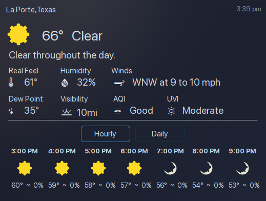

# pirateWeather
KDE Plasma 6 Plasmoid Weather Widget using Pirate Weather A Free, Flexable, and Open-Source Weather API <br>
Pirate Weather was developed on the closure of Dark Sky Weather providing an alternate open source option for weather data <br>

#### Compact View
 
 
#### Forecast View
 
 
Data Sources - https://docs.pirateweather.net/en/latest/DataSources/ <br>
Sign up for a free api key here https://pirate-weather.apiable.io/ <br>

* Install with
 ``` bash
git clone https://github.com/TxHammer68/pirateWeather /tmp/pirateWeather/ && kpackagetool6 -t Plasma/Applet -i /tmp/pirateWeather/
```
* Upgrade with
``` bash
git clone https://github.com/TxHammer68/pirateWeather /tmp/pirateWeather/ && kpackagetool6 -t Plasma/Applet -u /tmp/pirateWeather/
```
* Install widget to panel or desktop floating
* Right click on widget to configure
* Enter API Key
* Select mesurement units
* Select Update Interval (10-60 mins)
* Uses IP address to get geo coordinates - Disable VPN on first install/use
* Click Get GeoCodes to get Geo Coordinates Locatiion
* Click on the top right corner (last update time) to refresh data or Right Click on widget to Refresh Data
* Added Update Widget Button in the Config Screen
  * Logout after update for update to be applied
  * Verify settings/config after login
  * You can resize popup to get proper fit
