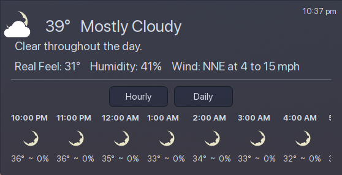

# pirateWeather
KDE Plasma 6 Plasmoid Weather Widget using Pirate Weather A Free, Flexable, and Open-Source Weather API <br>
Pirate Weather was developed on the closure of Dark Sky Weather providing an alternate open source option for weather data <br>
 
 
 
Sources - https://docs.pirateweather.net/en/latest/DataSources/ <br>
Sign up for a free apikey here https://pirate-weather.apiable.io/ <br>

* Install with
 ``` bash
git clone https://github.com/TxHammer68/pirateWeather && kpackagetool6 -t Plasma/Applet -i ./pirateWeather/
```
* Upgrade with
``` bash
git clone https://github.com/TxHammer68/pirateWeather && kpackagetool6 -t Plasma/Applet -u ./pirateWeather/
```
* Install widget to panel or desktop floating
* Right click on widget to configure
* Enter API Key
* Select mesurement units: Metric or Imperial
* Select Update Interval (10-60 mins)
* Uses IP address to get geo coordinates - Disable VPN on first install/use
* Click Get GeoCodes to get Geo Coordinates Locatiion
* Click on the top right corner (last update time) to refresh data or Right Click on widget to Refresh Data
